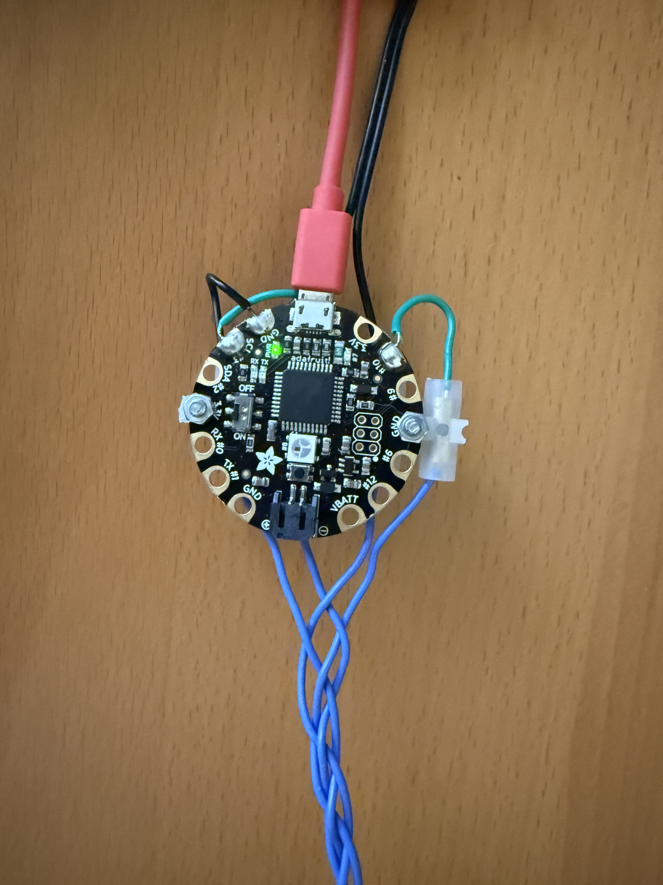
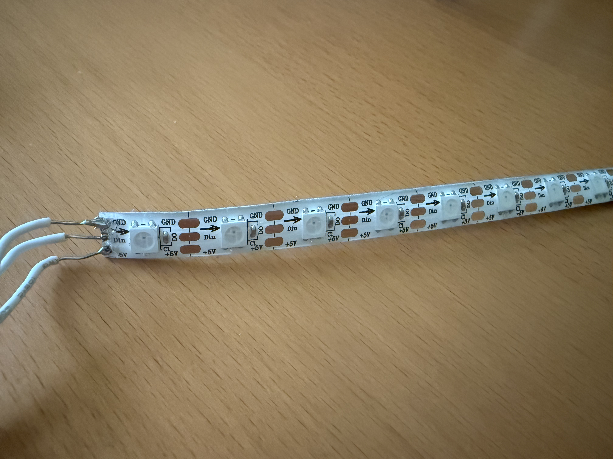
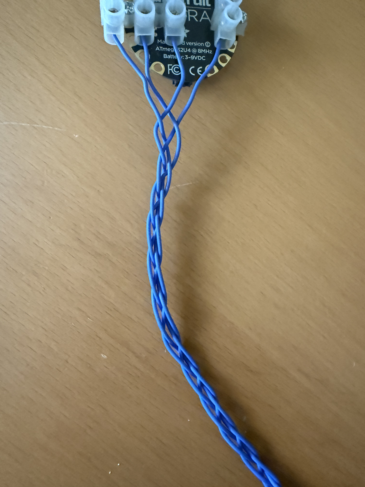
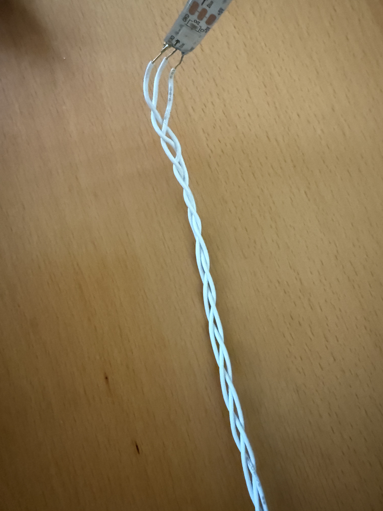
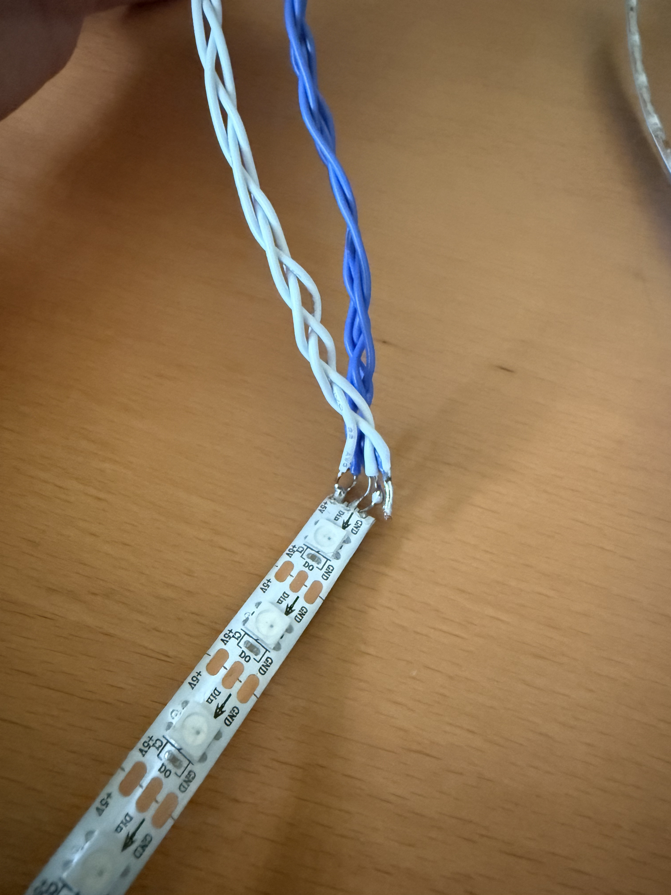
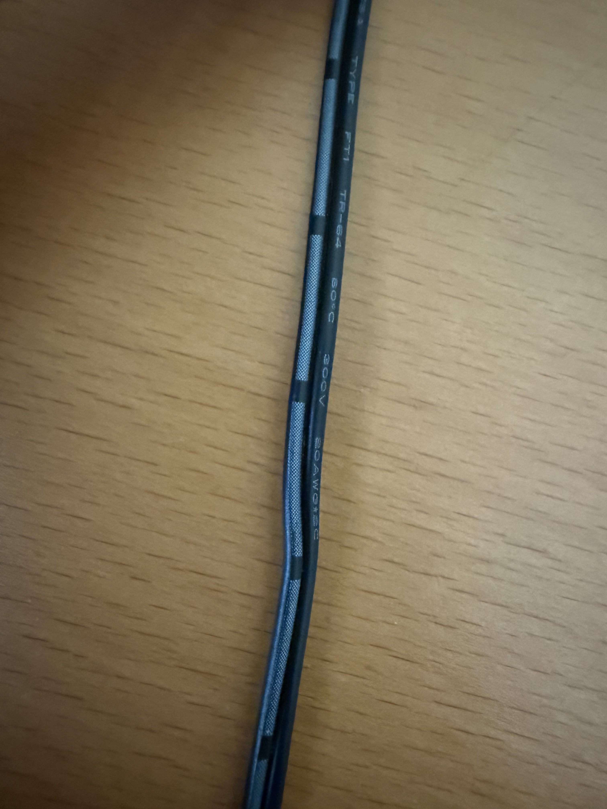
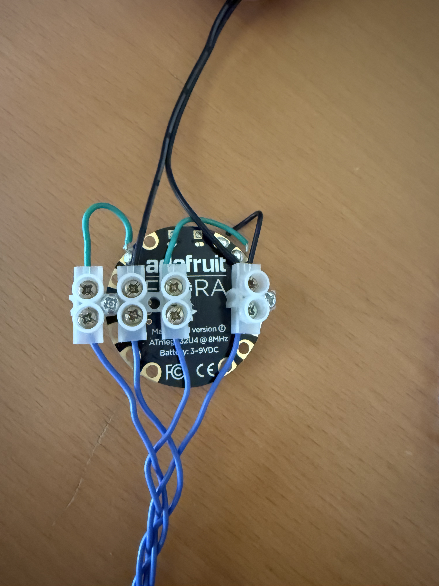

# RGB Led Strips Synchronized to Music

I made this repository because I wanted music synchronized RGB lights, but all the solutions I could find either had no demo video, or they were too obnoxious (changing to a random color every beat). So I decided to make my own.

## Demo

Coming Soon (End of September 2025 most likely)

## Building and Installation Guide

This is not meant to be a all-encompassing solution for all projects like this, rather think of this as a template to base your setup off of. 

### Part 1: The Hardware

The setup consists of:

1. Some software on your computer
2. Arduino (or simmilar microcontroller) connected via usb to your computer
3. Led strips
4. Wires to allow the led strips--unlike yourself, your computer, and the arduino--to be at a conveniently elevated location (e.g. a ceiling)
5. 5 volt power source

You should also have:
1. A soldering iron
2. A wire stripper or other means to strip wires of their shielding

For my microcontroller, I used an Arduino Flora because that is what I had on hand. However, anything that is programmable via Arduino IDE and that has a usb port should work.



The led strips I'm using are WS2812B 60Pixels/m. I'm using 5m of led strips in total (2.5m per side). The led strip protocol must be supported by the [FastLED](https://fastled.io/) library, and it should be clockless (3 wires rather than 4 wires). If using a Clocked (SPI) led strip, you will need to modify the arduino code somewhat.



To connect the led strips to the microcontroller, I braided some wires. The lengths of these wires should be derived from where your computer is relative to where the led strips shall be, and where the led strips shall be in relation to each other. For my setup, I have a 4-wire cable from the arduino to the base of one led strip, and a 3-wire cable from the base of one led strip to the base of the other led strip. The 4-wire cable has 5v, ground, data_left, and data_right; The 3-wire cable has 5v, ground, and data_right. 





For the power source, I sacrificed a microUSB charing brick. Just cut off the end, strip the wire, and twist the end to avoid fraying. My power cable had dashes along the + terminal (vis the image below). I am using a 12.5 watt power source for 90 watts worth of leds. This is fine because FastLED has a power limiter feature. It is worth noting that even with a weak power source, my setup is more than bright enough. In fact, I usually run it at half brightness.



To connect the 4-braided cable to the arduino and power source, I used these screw-based connectors for servicability, and because these are what I had readily available. Make sure to connect the ground of the power source to the ground of the arduino. Obviously, the connections here need to match the pinout of the led strips. Solder the other ends of the small connector wires for 2x data and 1x ground lines.



### Part 2: The Software

#### 1. VB-Cable

Download and install [VB-Cable](https://vb-audio.com/Cable/index.htm). The free version works just fine, as only one virtual audio device is necessary. This allows the program to capture sound output. Specifically, it redirects the sound output to a microphone channel, which the program can listen to. The program then forwards the sound to a sound output of your choice. There is probably a better way to do this. If you know a better way to do this, feel free to submit an issue or pull request.

#### 2. The program

1. Install python if you havn't already.
2. Install the required libraries with:

```
cd PC
pip install -r requirements.txt
``` 

#### 3. The Arduino

Use [Arduino IDE](https://www.arduino.cc/en/software/) to upload Arduino/Arduino.ino to your microcontroller. Make sure to modify NUM_LEDS, DATA_PIN_LEFT, DATA_PIN_RIGHT, MAX_POWER_MILLIAMPS, PROTOCOL, and COLOR_ORDER according to your setup. 

- NUM_LEDS is the number of leds for each side. Ex. if NUM_LEDS = 150, that means the microcontroller expects two led strips with 150 leds each.
- DATA_PIN_LEFT and DATA_PIN_RIGHT are the pins your led strip data pins are connected to on the microcontroller.
- MAX_POWER_MILLIAMPS is derived from your power source. 
- PROTOCOL is usually listed on the purchase page of the led strip
- COLOR_ORDER can be left alone for now, it will be set up later

To install FastLED, use the built in library manager. If you don't see your board listed, You might need to [configure additional Board Manager URLs](https://support.arduino.cc/hc/en-us/articles/360016466340-Add-third-party-platforms-to-the-Boards-Manager-in-Arduino-IDE). If, like me, you are using an Arduino Flora, you need the following url: 

```
https://adafruit.github.io/arduino-board-index/package_adafruit_index.json
```

### Part 3: Testing and Calibration

With everything set up, run 

```
python3 test.py
```

This should make the left led strip light up red, and right right led strip light up green. 

- If the strips don't light up, there is something wrong with your setup. Try checking your connections.
- If the stips light up the wrong colors, change COLOR_ORDER in Arduino.ino, re-upload, and re-run test.py. Repeat until the right color order is found.

## Usage instructions

1. Change your computer audio output to VB-Cable
2. With the terminal open, run the following:

```
cd PC
python3 main.py
```

- Select VB-Cable for the input device
- Select whichever speaker output
- Select the port your microcontroller is connected to

3. Try playing some music, and enjoy the show.

There are some parameters in main.py that alter the behavior of the leds. To change these type the following when the program is running:

```
setting=value
```
E.g.
```
brightness=0.25
```

Here is what each of the settings do:

| Name             | Datatype            | Intended Values        | Description                                                                 |
|------------------|---------------------|------------------------|-----------------------------------------------------------------------------|
| mode             | Integer             | 0                      | There is currently only one mode and that mode is 0.                        |
| white_multiplier | Decimal             | Positive               | Larger values make the color closer to white.                               |
| smoothing        | Decimal             | Positive               | Specifies the length of the fade out in seconds.                            |
| wobble           | Decimal             | 0 to 1                 | If the peak frequency in a given chunk is below wobble_start, then a wobble effect is applied, and this determines the strength of the effect. 0 Turns off the effect. |
| wobble_start     | Integer (frequency) | Positive               | Frequency threshold below which the wobble effect is applied. Default value is 60, which applies the wobble effect to just sub-bass. |
| brightness       | Decimal             | 0 to 1                 | Controls the brightness level of the LED strips.                            |
| bass_start       | Integer (frequency) | Positive               | Frequency threshold below which the bass_multiplier is applied. The value only matters if bass_multiplier is anything but 1.0. |
| bass_multiplier  | Decimal             | 0 to 1                 | During the color calculation, this can reduce the influence bass frequencies, potentially letting higher frequencies determine the hue. This is useful for bass boosted sound output, or music that is dominated by bass. |

Note that the program doesn't check if the values are in the recommended range, so bad values can raise exceptions.
